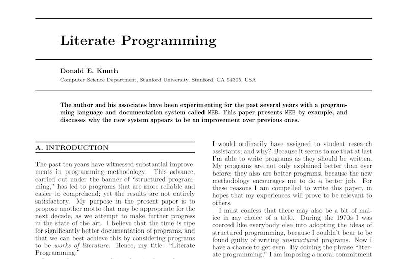
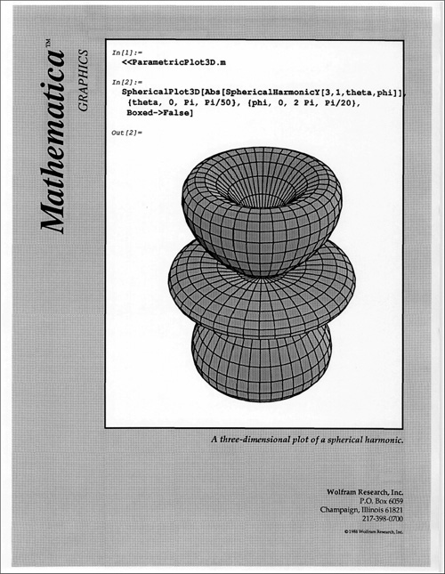
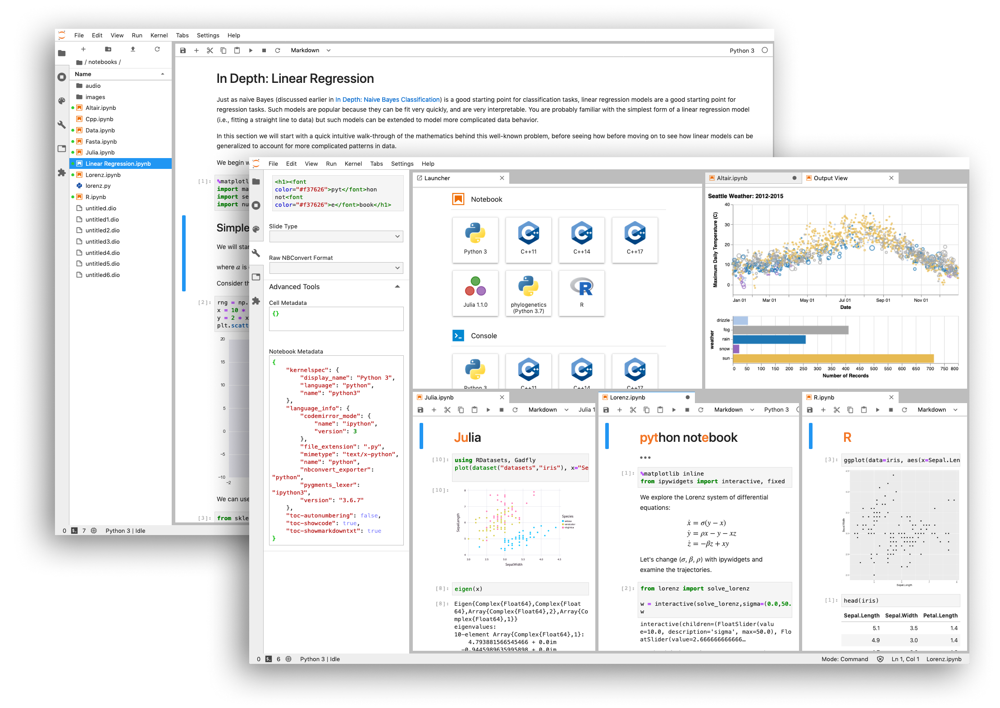

# R Markdown

-	Introduction
-	Installation
-	How It Works 
-	Components
  - Lunch
-	Analyze
-	Output

---

# Introduction

**Reproducible Data Science**

- In a biology wet lab researchers must keep a lab notebook - why should computational experiments be any different?

--

- Why do scientists keep a lab notebook?

--

- You should be able to go back to a coding project 10 years later, or send code to a colleague, and not only reproduce the same results - but understand why you got them!

---

# Literate Computing

- This isn’t a new idea

- Donald Knuth published **Literate Programming** in 1983

- A single document describes an analysis using **natural language** and **code snippets**

---

# Mathematica 

- Iimplemented a notebook in 1988.

---

# Jupyter

More recently, we’ve seen a resurgence of this with *IPython*, now *Jupyter* notebooks (which support many languages).

---

# R Markdown 

...fits right into this paradigm!

---

# Markdown..

- Lets look at markdown first before we explore R Markdown

---

# R Markdown...

---

# Lunch

## Questions?

---

# This presentation was adapted from these sources

- Peter Ralph, Univ. of Oregon, [R Markdown Tutorial](https://github.com/petrelharp/r-markdown-tutorial)
- RStudio's [R Markdown Introduction](https://rmarkdown.rstudio.com/lesson-1.html)
- Dan Veltri's [Introduction to R Markdown](https://bioinformatics.niaid.nih.gov/resources#10.4.4)

---

# Resources

*Cheatsheets*
- Look in the cheatsheets folder
  - [R Markdown cheatsheet](cheatsheeets/rmarkdown-reference.pdf)
  
*Books*
- [R Markdown: The Definitive Guide](https://bookdown.org/yihui/rmarkdown/)
- [R Markdown Cookbook](https://bookdown.org/yihui/rmarkdown-cookbook/)
- [R for Health Data Science](https://argoshare.is.ed.ac.uk/healthyr_book/the-anatomy-of-a-notebook-r-markdown-file.html)
- [Applied Statistics for Experimental Biology](https://www.middleprofessor.com/files/applied-biostatistics_bookdown/_book/)
- [knitr in a knutshell](https://kbroman.org/knitr_knutshell/)

*Other*
- [R Markdown Reference Guide](https://www.rstudio.com/wp-content/uploads/2015/03/rmarkdown-reference.pdf)
- [Karl Broman's](http://kbroman.org/knitr_knutshell/pages/Rmarkdown.html) intro to R Markdown
- [Stack](http://stackoverflow.com/questions/tagged/rmarkdown)[Overflow](http://stackoverflow.com/questions/tagged/knitr)
- http://rmarkdown.rstudio.com/authoring_pandoc_markdown.html

*Book Writing*
- [bookdown: Authoring Books and Technical Documents with R Markdown](https://bookdown.org/yihui/bookdown/)

*Websites*
- [R Markdown website building tutorial](https://www.emilyzabor.com/tutorials/rmarkdown_websites_tutorial.html)
