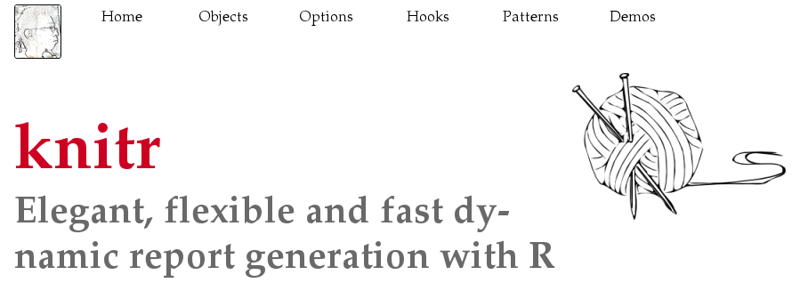

# R Markdown

-	Introduction & Overview
-	Installation
-	How It Works 
-	Components
  - Lunch
-	Analyze
-	Sharing


# Introduction

**Reproducible Data Science**

  - In a biology wet lab researchers must keep a lab notebook - why should computational experiments be any different?

. . .

  - Why do scientists keep a lab notebook?

. . .

  - You should be able to go back to a coding project 10 years later, or send code to a colleague, and not only reproduce the same results - but understand why you got them!


# Literate Computing

- This isn’t a new idea

. . .

- Donald Knuth published **Literate Programming** in 1983

. . .

- A single document describes an analysis using **natural language** and **code snippets**

. . .

- Mathematica implemented a notebook in 1988.

. . .

- More recently, we’ve seen a resurgence of this with IPython, now Jupyter notebooks (which support many languages).

. . .

- **R Markdown fits right into this paradigm!**

# What is Markdown?

- Markdown is plain text 
- Where formatting is indicated but not immediately shown/rendered.

- For example, this in markdown:
```{.markdown}
### Section
*my text*
```
becomes this when rendered:

### Section
*my text*


# R Markdown Overview

- R Markdown provides an authoring framework for data science

- You can use a single R Markdown file to both

  - Save and execute code

  - Generate high quality reports that can be shared

- R Markdown documents
  - Fully reproducible 
  - Support dozens of static and dynamic output formats

# R script vs Notebook vs Markdown

- R script
  - Source code (text) file containing R statements (.R extension)
- Markdown file
  - Text file containing markdown text (.md)
- R notebook
  - Interactive R file with text and code chunks (.Rmd)
- R Markdown
  - Markdown document with code chunks; executed to generate output (.Rmd)

R notebook vs markdown
  - Same file format - the difference is how YOU work with it.


#	Installation

- Like the rest of R, R Markdown is free and open source 
- You can install the R Markdown package from CRAN with:

  `install.packages("rmarkdown")`

#	How Does R Markdown Works?

{fig.align=center}

- When you run render, R Markdown feeds the .Rmd file to `knitr`, which executes all of the code chunks and creates a new markdown (.md) document which includes the code and its output.

- The markdown file generated by `knitr` is then processed by `pandoc` which is responsible for creating the finished format.

- May sound complicated, but R Markdown makes it simple...a single render function.


# R Markdown Components

Open RStudio -> File -> New file -> Rmarkdown -> Click OK

What do you see?
. . .

- Header
- Body 
  - Narrative Text
  - Code Chunks
  - Inline Code

# R Markdown: Header

- YAML?

. . .

- What are the options?

. . .

[R Markdown Reference Guide](https://www.rstudio.com/wp-content/uploads/2015/03/rmarkdown-reference.pdf)


# Markdown Basics
- Code Chunks
- Inline Code
- Parameters
- Tables


Code Chunks
=====
You can quickly insert chunks like these into your file with

the keyboard shortcut Ctrl + Alt + I (OS X: Cmd + Option + I)
the Add Chunk  command in the editor toolbar
or by typing the chunk delimiters ```{r} and ```.

When you render your .Rmd file, R Markdown will run each code chunk and embed the results beneath the code chunk in your final report.

- echo (default=TRUE): display code in the document
- eval (default=TRUE): run the code in the chunk
- tidy (default=FALSE): tidy the code displayed
- message (default=TRUE): display code messages in the document 
- include (default=TRUE): include the chunk in the document
- warning (default=TRUE): display code warnings in the document

See more here: https://bookdown.org/yihui/rmarkdown-cookbook/r-code.html

Inline Code
=====
Code results can be inserted directly into the text of a .Rmd file by enclosing the code with `r `. The file below uses `r ` twice to call colorFunc, which returns “heat.colors.”

```{r include=TRUE}
colorfunc <- "heat.colors"
# colorfunc <- "terrain.colors"
```

Base R comes with many functions for generating colors. The code below demonstrates the `r colorfunc` function.

Code Languages
=====
`knitr` can execute code in many languages besides R. Some of the available language engines include:
- Python
- SQL
- Bash
- Rcpp
- Stan
- JavaScript
- CSS

To process a code chunk using an alternate language engine, replace the r at the start of your chunk declaration with the name of the language:

https://bookdown.org/yihui/rmarkdown-cookbook/r-code.html

```{bash}
pwd
```
Note that chunk options like echo and results are all valid when using a language engine like python.


Parameters
=====
Click [here](https://rstudio.cloud/project/181942) to open in RStudio.cloud

{ width=75% height=75% }

# Parameters

R Markdown documents can include one or more parameters whose values can be set when you render the report. In the previous image, uses a data parameter that determines which data set to plot.

**Declaring Parameters**
Parameters are declared using the params field within the YAML header of the document. For example, the file above creates the parameter data and assigns it the default value "hawaii".

**Using Parameters in Code**
Parameters are made available within the knit environment as a read-only list named params. To access a parameter in code, call params$<parameter name>.

**Setting Parameters values**
Add a params argument to render to create a report that uses a new set of parameter values. Here we modify our report to use the aleutians data set with


# Tables

{ width=75% height=75% }


# Challenge / Exercise


# Analyze
Language: R, Python, SQL


# Sharing
-	Documents
- Presentations
- Notebooks
-	Slide Presentations
- Dashboards
- Websites
- Interactive Documents

# Documents
- html_notebook - Interactive R Notebooks
- html_document - HTML document w/ Bootstrap CSS
- pdf_document - PDF document (via LaTeX template)
- word_document - Microsoft Word document (docx)
- odt_document - OpenDocument Text document
- rtf_document - Rich Text Format document
- md_document - Markdown document (various flavors)


# Presentations (slides)
- ioslides_presentation - HTML presentation with ioslides
- revealjs::revealjs_presentation - HTML presentation with reveal.js
- slidy_presentation - HTML presentation with W3C Slidy
- beamer_presentation - PDF presentation with LaTeX Beamer
- powerpoint_presentation: PowerPoint presentation

# Notebooks


# Dashboards


# Websites


# Interactive Documents


# Reproduce

Learn how to publish and schedule reports


# So What is “Markdown?”
----------------------
Markdown is a programming language to enable basic text files to be easily exported to (X)HTML

Created in 2004 by John Gruber in collaboration with the late Aaron Swartz

Emphasis is placed on **readability** - the **.md** or **.markdown** files can be read on their own

Markdown is an informal specification, in 2016 groups started to make formal variants: MultiMarkdown, GitHub Flavored Markdown (GFM), **Pandoc**, CommonMark, etc.

Another Programming Language???
=============================


RELAX!
==========

Markdown:
-----

. . .

Communicate your thoughts to your collaborators and your future self,

. . .

combining text, documented code,even math, 

. . .

and **no fuss**.


-----------------------------------------


Source
---------------

````{.markdown}
Text formatting
===============

Inline markup
-------------

**Paragraphs** begin and end 
with empty lines, and are *not* indented.

- **bold** and *emphasis*
- ~~strikeout~~
- super^scripts^ and sub~scripts~
- and `inline_code($fixed.width)`

````

Result
----------------

### Text formatting


#### Inline markup


**Paragraphs** begin and end with empty lines,
and are *not* indented.

- **bold** and *emphasis*
- ~~strikeout~~
- super^scripts^ and sub~scripts~
- and `inline_code($fixed.width)`


Source
----------------

````{.markdown}
Lists must be preceded by an empty line,

1.  ordered or unordered.
1.  Indenting subsequent content
    
    -  will continue the list

        *   and nest
        *   other lists.

1.  *Indenting* means one tab, or four spaces.

After using markdown for a bit, 
go read [pandoc's documentation](http://pandoc.org/README.html).
````


---------------

Lists must be preceded by an empty line,

1.  ordered or unordered.
1.  Indenting subsequent content
    
    -  will continue the list

        *  and nest
        *  other lists.

1.  *Indenting* means one tab, or four spaces.

After using markdown for a bit, 
go read [pandoc's documentation](http://pandoc.org/README.html).


Math
----

```
Math goes between `$`, single ($\pi$), or double: 
$$ \frac{\pi}{4} = \sum_{n=0}^\infty \frac{(-1)^n}{2k+1} .$$
```
Math goes between `$`, single ($\pi$), or double: 
$$\frac{\pi}{4} = \sum_{n=0}^\infty \frac{(-1)^n}{2k+1} .$$


------------------

Even math environments *inside* double dollar signs:
```{.md}
$$
\begin{align}
    x &= (a+b)^2 - (a-b)^2 \\
      &= 4ab
\end{align}
$$
```
\begin{align}
    x &= (a+b)^2 - (a-b)^2 \\
      &= 4ab
\end{align}


Code blocks
-----------

    ```{.r}
    msg <- "Hello, world."
    print(msg)
    ```

**produces**

```{.R}
msg <- "Hello, world."
print(msg)
```

Blockquotes
-----------

    > I also dream about a modern replacement for LaTeX 
    > designed from the ground up to target multiple output formats 
    > (at least PDF, HTML, EPUB). -- [John MacFarlane](http://john.macfarlane.usesthis.com/)

**produces**

> I also dream about a modern replacement for LaTeX 
> designed from the ground up to target multiple output formats 
> (at least PDF, HTML, EPUB). -- [John MacFarlane](http://john.macfarlane.usesthis.com/)


Links and Images
------------------

A [link](https://rmarkdown.rstudio.com) just go in parentheses, 
and can be [internal](#links-and-images).

```{.markdown}
A [link](https://rmarkdown.rstudio.com) just go in parentheses, 
and can be [internal](#links-and-images).
```

----------------------

Images are **the same** but with a `!` in front. \
Setting width and height are optional.

```{.markdown}
{width=300px height=300px}
```

{width=300px height=300px}


Anatomy of an R Markdown File
=============================

Notice that the file contains three types of content:

- An (optional) YAML header surrounded by ---
- R code chunks surrounded by ```
- Text mixed with simple text formatting

Header
------

**Header** in YAML format with:
- Three dashes (to open)
- Title
- Author
- Date
- Output format(s)(Used for compiling - multiple output formats can be written here!)
- Three dashes (to close)

Body
====

The main Markdown and code content
Code chunks are offset by ``` before/after


Gotchas
-------


1.  many things need to begin with an empty line
1.  carriage returns don't (usually) mean anything
1.  but indentations do (*by at least four spaces*)


. . .


For more info see [the documentation](http://pandoc.org/README.html#the-four-space-rule).


Metadata
--------

At the top of your document, add 
```{.yaml}
---
title: YOUR TITLE HERE
author: YOUR NAME HERE
date: August 23, 2017
---
```

... the [YAML](http://yaml.org/) metadata, \
delimited by **exactly three** dashes.


-----------------

**Note:** Besides setting the title,
you can control the **output** in
[many](http://tex.stackexchange.com/questions/139139/adding-headers-and-footers-using-pandoc/139205#139205) 
[ways](http://rmarkdown.rstudio.com/html_document_format.html#pandoc-arguments) 
here.

*For example*: add

```{.yaml}
output_format : pdf_document
```

and render with `rmarkdown::render("notes.md")`.

. . .

**or even:**


```{.yaml}
output_format : word_document
```


Under the hood
--------------

[`pandoc`](http://pandoc.org/README.html)

```{.sh}
pandoc --help
```

{width=567px height=339px}


Adding in R
===========


-----------

**Goal:**
add R code to the document,
*along with its output*.

. . .




Go ahead
--------

Just add a *chunk* of R code, wrapped in

`````{.Rmd}
 ```{r}
 # PUT ARBITRARY R CODE HERE
 ```
`````

. . .

**Try it!**

----------

`````{.Rmd}
Powers of two?

 ```{r}
 2^(0:10)
 ```
`````

. . .

Powers of two?

```{r}
2^(0:10)
```

----------

`````{.Rmd}
How about this?
$$ \lim_{n \to \infty} 4 \sum_{k=1}^n \frac{ (-1)^n }{ 2n+1 } = \pi , $$

 ```{r}
 cumsum( 4 * (-1)^(0:20) / (2*(0:20)+1) )
 ```
`````

. . .

How about this?
$$ \lim_{n \to \infty} 4 \sum_{k=0}^n \frac{ (-1)^n }{ 2n+1 } = \pi , $$


```{r}
cumsum( 4 * (-1)^(0:20) / (2*(0:20)+1) )
```

--------

`````{.Rmd}
 ```{r}
 plot(cumsum( 4 * (-1)^(0:20) / (2*(0:20)+1) ))
 abline(h=pi, col='red')
 ```
`````

. . .


```{r, fig.height=3.5}
plot(cumsum( 4 * (-1)^(0:20) / (2*(0:20)+1) ))
abline(h=pi, col='red')
```

Exercise
--------

Make a short Rmarkdown document
that

- checks that $$1 + 2 + \cdots + n = n(n+1)/2$$
  for every $n$ between 1 and 100

- shows these on a plot

- explains what's being computed

*Useful:* `x = cumsum(1:100)` and `plot(x)` and `lines(y)`.


What's going on
---------------

1.  `knitr` uses a *regular expression* to find code chunks

    -  pulls these out, 
    -  evaluates them one at a time
    -  and inserts "the results" back in

2.  `pandoc` renders the resulting markdown file

    -   with various choices of styling


Chunk options
-------------

Name each chunk,
and set [options](http://yihui.name/knitr/options/)
for [what gets printed](http://yihui.name/knitr/demo/output/)

`````{.Rmd}
 ```{r my_chunk_name, fig.height=4, echo=FALSE}
`````


`echo=(TRUE|FALSE)` 

: include source code in the output?

`results="(markup|asis)"` 

: style the output or not?

`include=(FALSE|TRUE)` 

: include anything in the output?


-------------

Set document defaults up top:

```````{.Rmd}
 ```{r, include=FALSE}
 fig.dim <- 5
 library(knitr)
 opts_chunk$set(
        fig.height=fig.dim,
        fig.width=2*fig.dim,
        fig.align='center'
    )
 ```
```````


Tables
------

One option: use `pander`.

```````{.Rmd}
 ```{r}
 library(pander)
 bases <- table( sample( c("A","C","G","T"), 300, replace=TRUE ) )
 pander(t(bases))
 ```
```````

*note:* the transpose `t( )`

```{r}
 library(pander)
 bases <- table( sample( c("A","C","G","T"), 300, replace=TRUE ) )
 pander(t(bases))
```


Inline code
-----------

`````{.Rmd}
You can 
``r "r"` paste(letters[c(9,14,19,5,18,20)],collapse='')` 
code anywhere.
`````

You can 
`r paste(letters[c(9,14,19,5,18,20)],collapse='')` 
code anywhere.


--------------

Even in the YAML header.

Go change yours!

    ---
    title: "My notes"
    author: "Peter Ralph"
    date: "``r "r"` date()`"
    ---


Online example
==============

--------------

**Goal:** 
Write a function that will generate all sequences of `A`/`C`/`G`/`T` of length $n$
for which no two adjacent letters are the same.

. . .

Here is a [pre-written solution](examples/sequences.html).


Your turn
---------

Download the 
[iris dataset](https://raw.githubusercontent.com/petrelharp/r-markdown-tutorial/master/examples/iris.tsv) 
to a new directory.

or just do

````{.R}
data(iris)
dir.create("examples")
write.table(iris,file="examples/iris.tsv",sep="\t")
````

----------

1.  Read in the data.

2.  Describe the dataset: number of observations, variables, etcetera.

    - inline `R` code (`` ``r "r nrow(iris)"`` ``)

3.  Make a table of the number of observations for each species.

    * `pander()`
    * or `results="asis"` and `print.xtable(xtable( ),type='html')`

4.  Plot the flower dimensions against each other,

    * using `pairs()`, and colored by species.


Templated reports
=================

-----------------

Set up some fake data:
each has 50 observations of two quantitative variables (`age` and `height`)
and a categorical variable (`type`):

```{r make_data, warning=FALSE}
dir.create("examples/thedata")
owd <- setwd("examples/thedata")
for (samp in LETTERS[1:8]) {
    dir.create(samp)
    xy <- data.frame( 
        age=exp(rnorm(50)),
        type=sample(letters[1:3],50,replace=TRUE)
    )
    xy$height <- 5 + runif(1)*xy$age + 3*runif(1)*as.numeric(xy$type) + rnorm(50)
    write.table(xy,file=paste0(samp,"/data.tsv"))
}
setwd(owd)
```

------------------

We now have 10 datasets,
each in a file like [`A/data.tsv`](examples/thedata/A/data.tsv).
Here's what one looks like:
```{r show_data}
xy
```

------------------

We would like to *visualize* each, 
like this:

# ```{r plot_one_data, echo=FALSE}
# xy <- data.frame(
#  age=exp(rnorm(50)),
#  type=sample(letters[1:3],50,replace=TRUE)
#  )
# xy$height <- 5 + runif(1)*xy$age + 3*runif(1)*as.numeric(xy$type) + rnorm(50)/3
# with(xy, plot( height ~ age, col=type ) )
# legend( "topleft", pch=1, legend=levels(xy$type), col=1:nlevels(xy$type) )
# ```


---------------------

**The template:** `examples/simple-template.Rmd`

``````{.Rmd}
 ---
 title: "Visualization for ``r "r"` getwd()`"
 date: "``r "r"` date()`"
 ---

# ```{r setup, echo=FALSE}
# input.file <- "data.tsv"
# xy <- read.table(input.file)
# ```

 The file ``r "r"` normalizePath(input.file)`
 has ``r "r"` nrow(xy)` observations:

# ```{r}
# plot( height ~ age, col=type, data=xy )
# legend( "topleft", pch=1, col=1:nlevels(xy$type) )
#w ```
``````

**Input:** this looks for the file `data.tsv` in the current directory.

-----------------------

**Render it:**

*Option 1:* copy the template into each of the ten directories, and render them there.

. . .

*Option 2:* use my `templater` package.


```{r, eval=FALSE}
library(devtools)
install_github("petrelharp/templater")
library(templater)
dir.names <- file.path("examples/thedata", LETTERS[1:8])
for (input.dir in dir.names) {
    output.file <- file.path(input.dir, "visualization.html")
    render_template("examples/simple-template.Rmd", output=output.file, 
                    change.rootdir=TRUE, quiet=TRUE)
}
```


-------------------------

**Look at them:**

#`````{.Rmd}
# ```{r make_links1, results="asis"}
# output.files <- file.path("examples/thedata", LETTERS[1:8], "visualization.html")
# links <- paste("[",dir.names,"](",output.files,")",sep='')
# cat( paste("- ", links, "\n"), "\n" )
# ```
`````

```{r make_links, results="asis", echo=FALSE}
dir.names <- file.path("examples/thedata", LETTERS[1:8])
output.files <- file.path("examples/thedata", LETTERS[1:8], "visualization.html")
links <- paste("[",dir.names,"](",output.files,")",sep='')
cat( paste("- ", links, "\n"), "\n" )
```


Another exercise
----------------

**Goal:**
Compare different $k$ with $k$-means on the `iris` dataset.

1.  Make subdirectories, called `iris/k`, for $1 \le k \le 5$,
2.  and in each runs `kmeans` with the appropriate `k`.

Example:
```{r eval=FALSE}
data(iris)
km <- kmeans(iris[,1:4], centers=3)
pairs(iris, col=km$cluster)
```

Sources
=======
- Peter Ralph, Univ. of Oregon, [Rmarkdown Tutorial](https://github.com/petrelharp/r-markdown-tutorial)
- RStudio's [Rmarkdown Introduction](https://rmarkdown.rstudio.com/lesson-1.html)


Resources
===============
- [R Markdown: The Definitive Guide](https://bookdown.org/yihui/rmarkdown/)
- [R Markdown Cookbook](https://bookdown.org/yihui/rmarkdown-cookbook/)

- [bookdown: Authoring Books and Technical Documents with R Markdown](https://bookdown.org/yihui/bookdown/)
- [Karl Broman's](http://kbroman.org/knitr_knutshell/pages/Rmarkdown.html) intro to R Markdown
- [R for Health Data Science](https://argoshare.is.ed.ac.uk/healthyr_book/the-anatomy-of-a-notebook-r-markdown-file.html)
-  [Stack](http://stackoverflow.com/questions/tagged/rmarkdown)[Overflow](http://stackoverflow.com/questions/tagged/knitr)
-  my [technical notes](technical-notes.html) I made while writing this up
- http://rmarkdown.rstudio.com/authoring_pandoc_markdown.html
- [R Markdown website tutorial](https://www.emilyzabor.com/tutorials/rmarkdown_websites_tutorial.html)
- [Applied Statistics for Experimental Biology](https://www.middleprofessor.com/files/applied-biostatistics_bookdown/_book/)