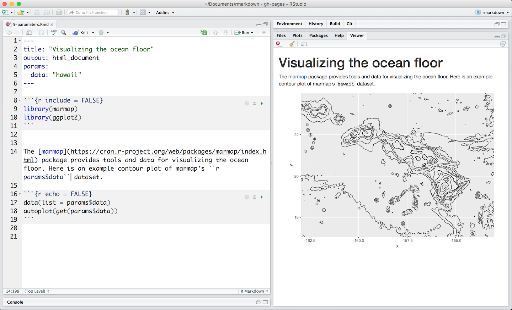

# R Markdown

-	Introduction & Overview
-	Installation
-	How It Works 
-	Components
  - Lunch
-	Analyze
-	Sharing


# Introduction

**Reproducible Data Science**

  - In a biology wet lab researchers must keep a lab notebook - why should computational experiments be any different?

. . .

  - Why do scientists keep a lab notebook?

. . .

  - You should be able to go back to a coding project 10 years later, or send code to a colleague, and not only reproduce the same results - but understand why you got them!


# Literate Computing

- This isn’t a new idea

. . .

- Donald Knuth published **Literate Programming** in 1983

. . .

- A single document describes an analysis using **natural language** and **code snippets**

. . .

- Mathematica implemented a notebook in 1988.

. . .

- More recently, we’ve seen a resurgence of this with *IPython*, now *Jupyter* notebooks (which support many languages).

. . .

- **R Markdown fits right into this paradigm!**


# Before We Get to R Markdown, What is Markdown?

Markdown is a programming language to enable basic text files to be easily exported to (X)HTML

Created in 2004 by John Gruber in collaboration with the late Aaron Swartz

Emphasis is placed on **readability** - the **.md** or **.markdown** files can be read on their own

Markdown is an informal specification, in 2016 groups started to make formal variants: MultiMarkdown, GitHub Flavored Markdown (GFM), **Pandoc**, CommonMark, etc.


# Another Programming Language???


# RELAX!

# Markdown

- Markdown enables you to communicate your thoughts to your collaborators and your future self,

. . .

- Combining text, documented code, even math, 

. . .

- and **no fuss**.

# Markdown Playground

- Open a new tab by clicking [here](https://stackedit.io/app)
- We will look at some markdown, try them out for yourselves

# What Markdown looks like

````{.markdown}
Text formatting
===============

Inline markup
-------------

**Paragraphs** begin and end 
with empty lines, and are *not* indented.

- **bold** and *emphasis*
- ~~strikeout~~
- super^scripts^ and sub~scripts~
- and `inline_code($fixed.width)`

````

# What Markdown Formats to:

### Text formatting

#### Inline markup

**Paragraphs** begin and end with empty lines,
and are *not* indented.

- **bold** and *emphasis*
- ~~strikeout~~
- super^scripts^ and sub~scripts~
- and `inline_code($fixed.width)`


# More Markdown

````{.markdown}
Lists must be preceded by an empty line,

1.  ordered or unordered.
1.  Indenting subsequent content
    
    -  will continue the list

        *   and nest
        *   other lists.

1.  *Indenting* means one tab, or four spaces.
````


# More Markdown Results

Lists must be preceded by an empty line,

1.  ordered or unordered.
1.  Indenting subsequent content
    
    -  will continue the list

        *  and nest
        *  other lists.

1.  *Indenting* means one tab, or four spaces.


# Markdown Can Do Math

```
Math goes between `$`, single ($\pi$), or double: 
$$ \frac{\pi}{4} = \sum_{n=0}^\infty \frac{(-1)^n}{2k+1} .$$
```
Math goes between `$`, single ($\pi$), or double: 
$$\frac{\pi}{4} = \sum_{n=0}^\infty \frac{(-1)^n}{2k+1} .$$


# Markdown Can Do Math

Even math environments *inside* double dollar signs:
```{.md}
$$
\begin{align}
    x &= (a+b)^2 - (a-b)^2 \\
      &= 4ab
\end{align}
$$
```
\begin{align}
    x &= (a+b)^2 - (a-b)^2 \\
      &= 4ab
\end{align}


# Code blocks

```{.r}
msg <- "Hello, world."
print(msg)
```

**produces**

```{r}
msg <- "Hello, world."
print(msg)
```

# Blockquotes

    > I also dream about a modern replacement for LaTeX 
    > designed from the ground up to target multiple output formats 
    > (at least PDF, HTML, EPUB). -- [John MacFarlane](http://john.macfarlane.usesthis.com/)

**produces**

> I also dream about a modern replacement for LaTeX 
> designed from the ground up to target multiple output formats 
> (at least PDF, HTML, EPUB). -- [John MacFarlane](http://john.macfarlane.usesthis.com/)


# Links

A [link](https://rmarkdown.rstudio.com) just go in parentheses, 
and can be [internal](#links-and-images).

```{.markdown}
A [link](https://rmarkdown.rstudio.com) just go in parentheses, 
and can be [internal](#links-and-images).
```

# Images

Images are **the same** but with a `!` in front. \
Setting width and height are optional.

```{.markdown}
{width=300px height=300px}
```

{width=300px height=300px}

# Questions about Markdown?

- People use Markdown in many places:
  - RMarkdown documents
  - Jupyter notebooks
  - GitHub
  - [Websites](https://www.markdownguide.org/getting-started/#websites)
  - [Documents](https://www.markdownguide.org/getting-started/#documents)
  - [Notes](https://www.markdownguide.org/getting-started/#notes)
  - [Books](https://www.markdownguide.org/getting-started/#books)
  - [Presentations](https://www.markdownguide.org/getting-started/#presentations)
  - [Email messages](https://www.markdownguide.org/getting-started/#email)
  - [Technical documentation](https://www.markdownguide.org/getting-started/#documentation)

- Check out the [Markdown Guide](https://www.markdownguide.org/cheat-sheet/)
- After using markdown for a bit, go read [pandoc's documentation](http://pandoc.org/README.html).

# Are You Ready To Learn About R + Markdown?

# R Markdown Overview

- R Markdown provides an authoring framework for data science

. . .

- You can use a single R Markdown file to both

  - Save and execute code

  - Generate high quality reports that can be shared

. . .

- R Markdown documents
  - Fully reproducible 
  - Support dozens of static and dynamic output formats

# What is possible with RMarkdown

- Click the link to see the R Markdown [Gallery](https://rmarkdown.rstudio.com/gallery.html).

# R Script vs Notebook vs Markdown

- R script
  - Source code (text) file containing R statements (.R extension)
- Markdown file
  - Text file containing markdown text (.md)
- R notebook
  - Interactive R file with text and code chunks (.Rmd)
- R Markdown
  - Markdown document with code chunks; executed to generate output (.Rmd)

*R Notebook vs RMarkdown*
  - Same file format - the difference is how YOU work with it.

# Difference between RMarkdown and RNotebooks

- R Markdown documents are ‘knitted’, while R Notebooks are ‘previewed’.
- Although the notebook preview looks similar to the knitted markdown document, the notebook preview does not execute any code chunks, but only shows you a rendered copy of the Markdown output of your document along with the most recent chunk output. The preview is also generated automatically whenever the notebook is saved. This would be especially useful if we have the preview showing in the Viewer window next to the console. This means that in R Notebooks, we are able to visually assess the output as we develop the document without having to knit the whole document again.
- For example, with the following code chunk example (from the RMarkdown_Tutorial.R practice script), we are creating a table of species richness for each taxonomic group.
- ```{r} richness <- edidiv %>% group_by(taxonGroup) %>% summarise(Species_richness = n_distinct(taxonName)) ``` 
- To bring up the table output, we can add richness, pander(richness), kable(richness) to the end of that code chunk. If we had initially forgotten to add in either one of those functions, the table would not have been produced in both the knitted markdown document and the notebook preview. Imagine that we are now editing the R Markdown document / R Notebook document to include this function to bring up the table in the outputted document.
- For RMarkdown: we would type in pander(richness), run that specific code chunk, and then have to click the Knit button in the taskbar to knit the whole document again.
- For R Notebooks, we type in pander(richness), run that specific code chunk, and save the document, and the preview in the Viewer window would be updated on its own - there is no need to click the Preview button in the taskbar and run the code for the whole document.
- Note: R Markdown Notebooks are only available in RStudio 1.0 or higher.


#	Installation

- Like the rest of R, R Markdown is free and open source 
- You can install the R Markdown package from CRAN with:

  `install.packages("rmarkdown")`

#	How Does R Markdown Works?

{fig.align=center}

- When you run render, R Markdown feeds the .Rmd file to `knitr`, which executes all of the code chunks and creates a new markdown (.md) document which includes the code and its output.

- The markdown file generated by `knitr` is then processed by `pandoc` which is responsible for creating the finished format.

- May sound complicated, but R Markdown makes it simple...a single render function.

# Workflow

An example RMarkdown workflow:

1. Open a **new .Rmd file** in the RStudio IDE by going to ~File > New File > R Markdown~
2. **Embed code** in chunks. Run code by line, by chunk, or all at once.
3. **Write text** and add tables, figures, images, and citations. Format with Markdown syntax or the RStudio Visual Markdown Editor.
4. **Set output format(s) and options** in the YAML header. Customize themes or add parameters to execute or add interactivity with Shiny.
5. **Save and render** the whole document. Knit periodically to preview your work as you write. 6. **Share your work!**


# Anatomy of an R Markdown File

Open RStudio -> File -> New file -> Rmarkdown -> Click OK

Notice that the file contains three types of content:

- An (optional) YAML header surrounded by ---
- R code chunks surrounded by ```
- Text mixed with simple text formatting

Header
------

**Header** in YAML format with:
- Three dashes (to open)
- Title
- Author
- Date
- Output format(s)(Used for compiling - multiple output formats can be written here!)
- Three dashes (to close)

# Anatomy of an R Markdown File

Body Options
------------

- Code Chunks
- Inline Code
- Parameters
- Tables
- Markdown


# Code Chunks: Adding in R

**Goal:**
add R code to the document,
*along with its output*.

Go ahead

Just add a *chunk* of R code, wrapped in

````
`r ''`
```{r}
1 + 1
```
````

# Code Chunks: Adding in R

**Try it!**

Powers of two?
````
`r ''`
```{r}
2^(0:10)
```
````

. . .

Powers of two?

```{r}
2^(0:10)
```

# Code Chunks: Adding in R

How about this?
````
$$ \lim_{n \to \infty} 4 \sum_{k=1}^n \frac{ (-1)^n }{ 2n+1 } = \pi , $$
````

. . .

$$ \lim_{n \to \infty} 4 \sum_{k=0}^n \frac{ (-1)^n }{ 2n+1 } = \pi , $$

# Code Chunks: Adding in R

````
`r ''`
```{r}
cumsum( 4 * (-1)^(0:20) / (2*(0:20)+1) )
```
````

. . .

```{r}
cumsum( 4 * (-1)^(0:20) / (2*(0:20)+1) )
```

# Code Chunks: Adding in R

````
`r ''`
```{r}
plot(cumsum( 4 * (-1)^(0:20) / (2*(0:20)+1) ))
abline(h=pi, col='red')
```
````

. . .


```{r, fig.height=3.5}
plot(cumsum( 4 * (-1)^(0:20) / (2*(0:20)+1) ))
abline(h=pi, col='red')
```

# Exercise

???

# Code Chunks: Adding in R

- You can quickly insert chunks like these into your file with 
  - the keyboard shortcut Ctrl + Alt + I (OS X: Cmd + Option + I)
  - the Add Chunk  command in the editor toolbar
  - or by typing the chunk delimiters ```{r} and ```.

When you render your .Rmd file, R Markdown will run each code chunk and embed the results beneath the code chunk in your final report.

# Code Chunks: Adding in R

- Code chunks can be displayed or not using options

````
`r ''`
```{r echo=FALSE}
2^(0:10)
```
````

- echo (default=TRUE): display code in the document
- eval (default=TRUE): run the code in the chunk
- tidy (default=FALSE): tidy the code displayed
- message (default=TRUE): display code messages in the document 
- include (default=TRUE): include the chunk in the document
- warning (default=TRUE): display code warnings in the document

See more here: https://bookdown.org/yihui/rmarkdown-cookbook/r-code.html

# Inline Code

- Code results can be inserted directly into the text of a .Rmd file by enclosing the code with `r `. The file below uses `r ` twice to call colorFunc, which returns “heat.colors.”

```{r include=TRUE}
colorfunc <- "heat.colors"
# colorfunc <- "terrain.colors"
```

Base R comes with many functions for generating colors. The code below demonstrates the `r colorfunc` function.

# Code Languages

- `knitr` can execute code in many languages besides R. 

- Some of the available language engines include:
  - Python
  - SQL
  - Bash
  - Rcpp
  - JavaScript
  - CSS

- To process a code chunk using an alternate language engine, replace the r at the start of your chunk declaration with the name of the language

```{bash}
pwd
```
- Note that chunk options like echo and results are all valid when using a language engine like python.

- Note, *except for python*, these sessions are closed at the end of each code chunk so variables do not persist throughout the document

https://bookdown.org/yihui/rmarkdown-cookbook/r-code.html

# Challenge

???

### Lets list some parts of the cell!

```{python python-chunk}
parts = ['nucleus','ribosome','plasma membrane','mitochondria','endoplasmic reticulum']
for p in parts:
  print(p)
```

### Lets list some types of bacteria by genus!
```{ruby ruby-chunk}
bacs = ['Micrococcus','Staphylococcus','Bacillus','Pseudomona']
bacs.each {|b| puts b}
```


# Parameters

Click [here](https://rstudio.cloud/project/181942) to open in RStudio.cloud

{ width=75% height=75% }

# Parameters

R Markdown documents can include one or more parameters whose values can be set when you render the report. In the previous image, uses a data parameter that determines which data set to plot.

**Declaring Parameters**
Parameters are declared using the params field within the YAML header of the document. For example, the file above creates the parameter data and assigns it the default value "hawaii".

**Using Parameters in Code**
Parameters are made available within the knit environment as a read-only list named params. To access a parameter in code, call params$<parameter name>.

**Setting Parameters values**
Add a params argument to render to create a report that uses a new set of parameter values. Here we modify our report to use the aleutians data set with


# Tables

{ width=75% height=75% }


# Challenge / Exercise

The *NIEHS_NTP_SUBSTANCES.csv* data set from the National Toxicology Program has a list of known toxic substances that are studied at NIEHS.

*Challenge*: Your boss needs to set their budget next year to buy lab equipment and make supplier contracts. They ask you to create an HTML table with the following columns to include in their report: Substance Category, Substance Name, Analysis Method, and Supplier.

Try to make the nicest looking table you can!


# Lunch


# Analyze

- R
- Python
- SQL


# Sharing
-	Documents
- Presentations
- Notebooks
-	Slide Presentations
- Dashboards
- Websites
- Interactive Documents

# Documents
- html_notebook - Interactive R Notebooks
- html_document - HTML document w/ Bootstrap CSS
- pdf_document - PDF document (via LaTeX template)
- word_document - Microsoft Word document (docx)
- odt_document - OpenDocument Text document
- rtf_document - Rich Text Format document
- md_document - Markdown document (various flavors)


# Presentations (slides)
- ioslides_presentation - HTML presentation with ioslides
- revealjs::revealjs_presentation - HTML presentation with reveal.js
- slidy_presentation - HTML presentation with W3C Slidy
- beamer_presentation - PDF presentation with LaTeX Beamer
- powerpoint_presentation: PowerPoint presentation

# Notebooks

- Rmarkdown enables you to build an analysis notebook called an R notebook

- R Notebook (demo)

- We will build a notebook a little later

# Dashboards

- flexdashbaord (demo)

# Interactive Presentation

- RShiny (demo)


# Practice

This afternoon we will build the following:

- html document
- slides
- R notebook
- RShiny app


# This presentation was adapted from these sources

- Peter Ralph, Univ. of Oregon, [Rmarkdown Tutorial](https://github.com/petrelharp/r-markdown-tutorial)
- RStudio's [Rmarkdown Introduction](https://rmarkdown.rstudio.com/lesson-1.html)


# Resources

*Books*
- [R Markdown: The Definitive Guide](https://bookdown.org/yihui/rmarkdown/)
- [R Markdown Cookbook](https://bookdown.org/yihui/rmarkdown-cookbook/)
- [R for Health Data Science](https://argoshare.is.ed.ac.uk/healthyr_book/the-anatomy-of-a-notebook-r-markdown-file.html)
- [Applied Statistics for Experimental Biology](https://www.middleprofessor.com/files/applied-biostatistics_bookdown/_book/)

*Other*
- [R Markdown Reference Guide](https://www.rstudio.com/wp-content/uploads/2015/03/rmarkdown-reference.pdf)
- [Karl Broman's](http://kbroman.org/knitr_knutshell/pages/Rmarkdown.html) intro to R Markdown
- [Stack](http://stackoverflow.com/questions/tagged/rmarkdown)[Overflow](http://stackoverflow.com/questions/tagged/knitr)
- http://rmarkdown.rstudio.com/authoring_pandoc_markdown.html

*Book Writing*
- [bookdown: Authoring Books and Technical Documents with R Markdown](https://bookdown.org/yihui/bookdown/)

*Websites*
- [R Markdown website building tutorial](https://www.emilyzabor.com/tutorials/rmarkdown_websites_tutorial.html)
